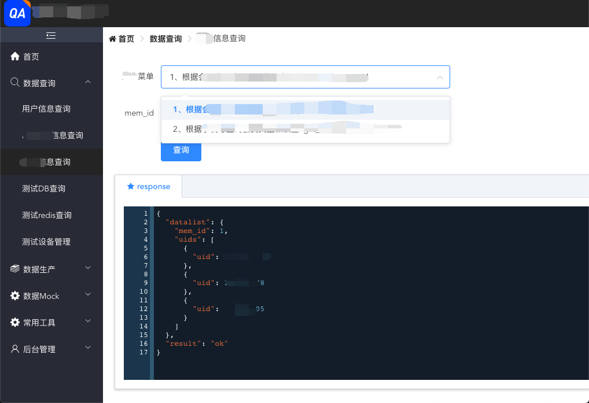
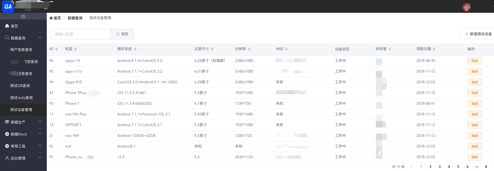

# ds-admin-fe
> 一个基于vue2.x编写的后端管理项目

### 说明

  这是一个用vuejs2.x和element-ui2.x搭建的后台管理项目。

  主要界面：
  - 对接公司层面的扫码登录接口（目前统一入口企业微信扫码）

    
  - 扫码登录后，主界面如下：
    
    

### 项目结构
```
├── build  #webpack编译相关文件目录，一般不用动
├── config  #配置目录
│   ├────dev.env.js  #开发环境变量
│   ├────index.js    #主配置文件
│   └────prod.env.js #生产环境变量
├── dist  #生产环境下build后的文件存放目录（发布目录）
├── src #前端项目源码目录
│   ├───—api  #封装的接口文件目录
│   ├───—assets  #资源目录
│   ├───—common  #公用文件目录
│   ├───—components  #组件目录
│   ├───—store  #状态管理目录
│   ├───—router  #路由目录
│   ├───—tools  #工具目录
│   ├───—views  #页面目录
│   ├───—App.vue #项目入口文件
│   ├───—bus.js  #公共通信组件
│   └────main.js  #项目的核心文件
├── static  #开发模式下的静态资源目录
├── index.html #首页入口文件，你可以添加一些 meta 信息或同统计代码啥的
├── package.json #项目配置文件
└── README.md #项目的说明文档，markdown 格式
```

## 项目编译和运行

``` bash
第一步： 先安装node v8.2.1环境，自行百度。

第二步：下载项目
可以直接在gitlab上下载项目源码。
或者通过git命令下载
#git命令下载
git clone https://xxx.xxx.com/git/qa/ds_admin_django.git

假定项目已经下载下来了。

第三步：启动服务端
（1）新开一个命令行窗口
（2）定位到项目中的后端目录，如下：
  > cd 你自己的位置/ds_admin/ds_admin_django
  > sh run.sh start
  # Server port 9527
  # BaseUrl http://localhost:9527


第四步：启动前端
（1）新开一个命令行窗口
（2）定位到项目目录并安装依赖
  > cd 你自己的位置/ds_admin/ds_admin_fe/
  > npm install
（3）依赖安装成功后执行启动命令
  > npm run dev
  # 显示如下内容说明本地启动成功
  # DONE Compiled successfully in 7515ms
  # Listening at http://localhost:8085


#正式环境编译命令
# build for production with minification
npm run build

```
#编译完成发布dist目录到nginx服务器即可
参考发布脚本admin_build_auto.sh

### 更新日志
> 2018-11-13
 >> 1.fe_v1.0.0发布。
